# Конструювання програнмого забезпечення
## Лабораторна робота №1 "Проходження інтерактивного курсу «Git How To»"

### Виконав: *Биков Віктор з групи ІПЗ 3.03*
---

Під час лабораторної роботи було покроково пройдено першу частину курсу "Git how to".

**1. Фінальні приготування**
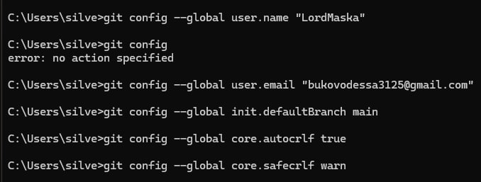

**2. Створення проекту**
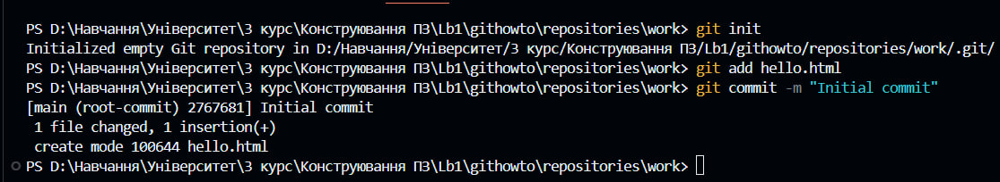

**3. Перевірка стану**
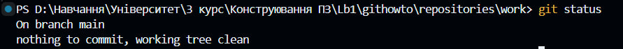
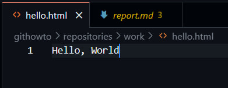

**4. Внесення змін**
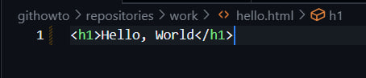

**5. Індексація змін**
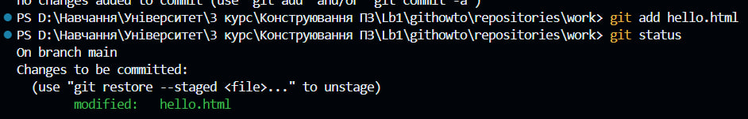

**6. Індексація та коміт**
*На даному кроці не потребувалось виконання конкретних дій, а загально пояснювалось про роботу індексації змін та коміту, тому скріншот відсутній.*

**7. Коміт змін**
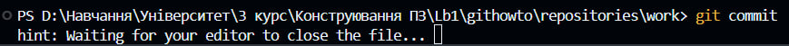
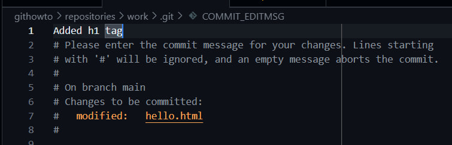
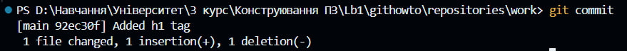
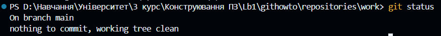

**8. Зміни, а не файли**
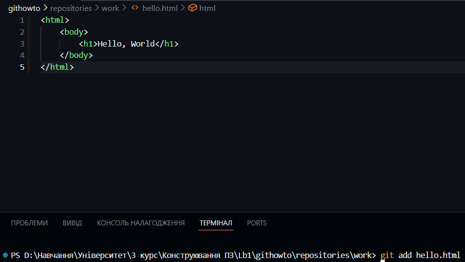
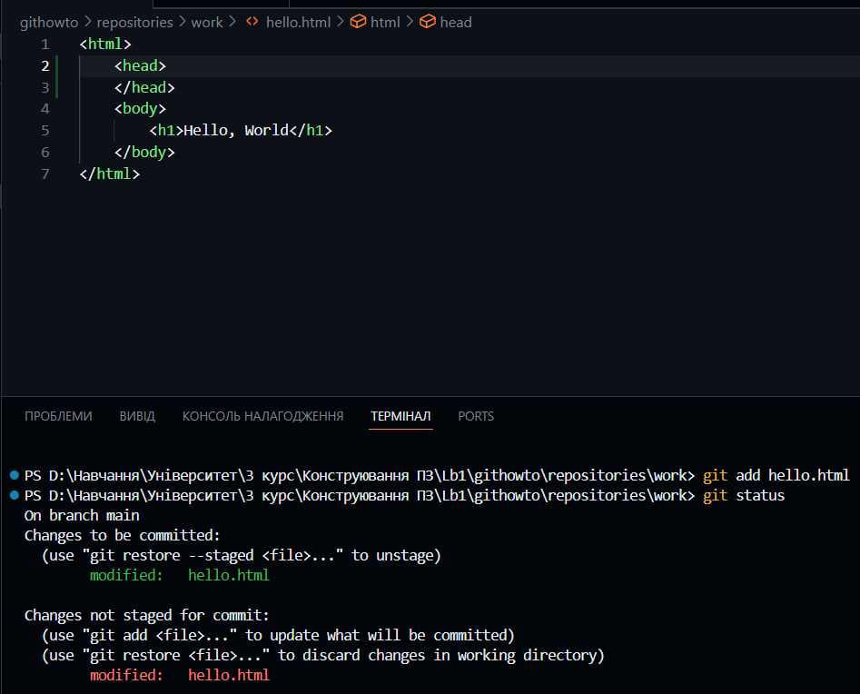

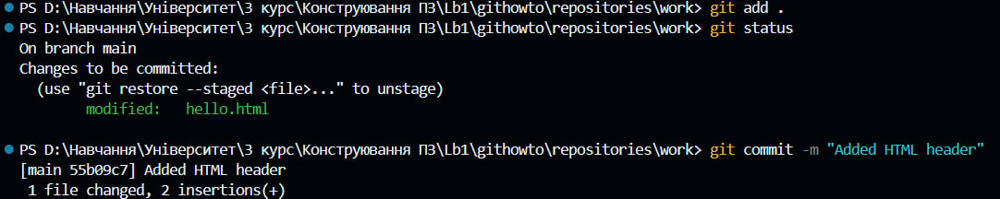

**9. Історія проекту**
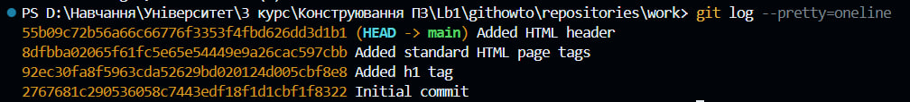

**10. Отримання старих версій**
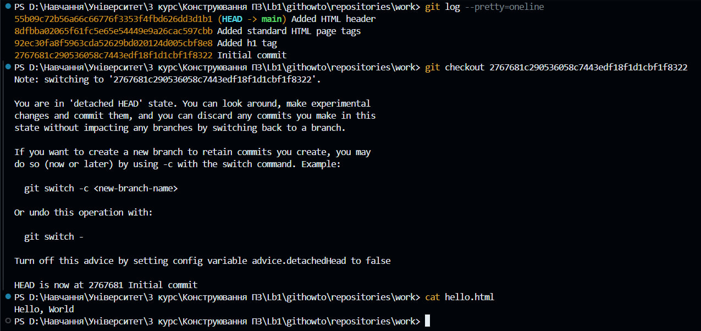
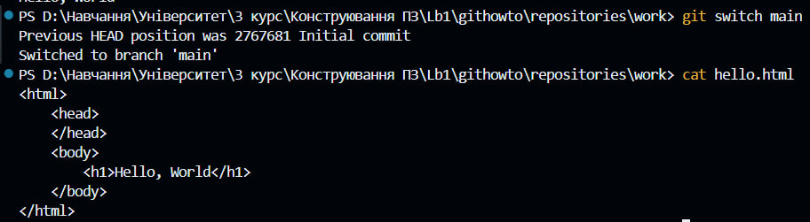

**11. Створення тегів версій**
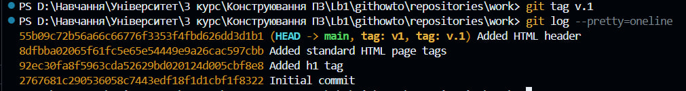
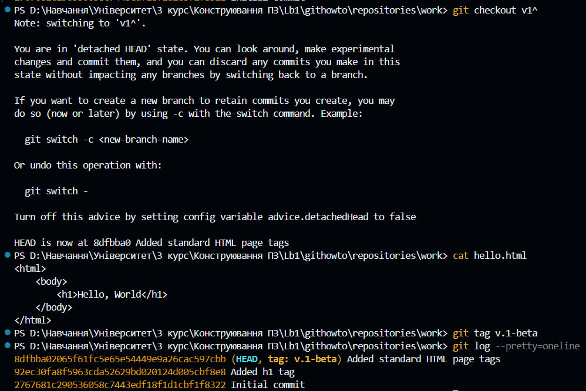
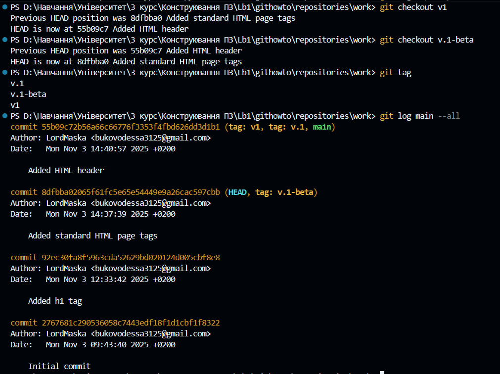

**12. Скасування локальних змін (до індексації)**
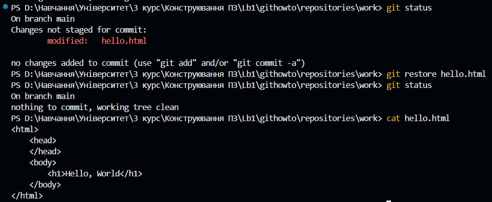

**13. Скасування проіндексованих змін (перед комітом)**
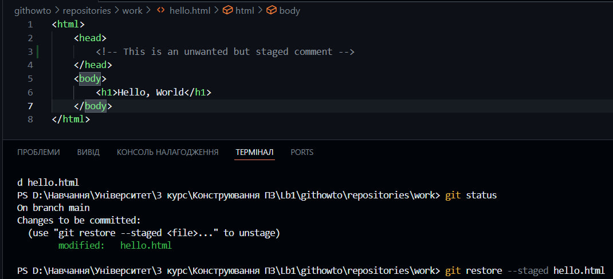
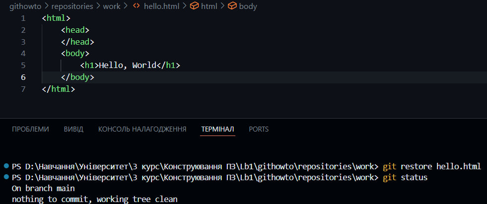

**14. Скасування комітів**

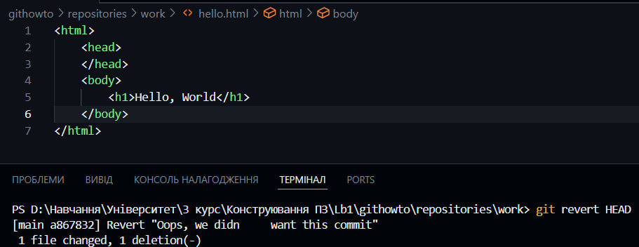

**15. Видалення комітів з гілки (revert)**

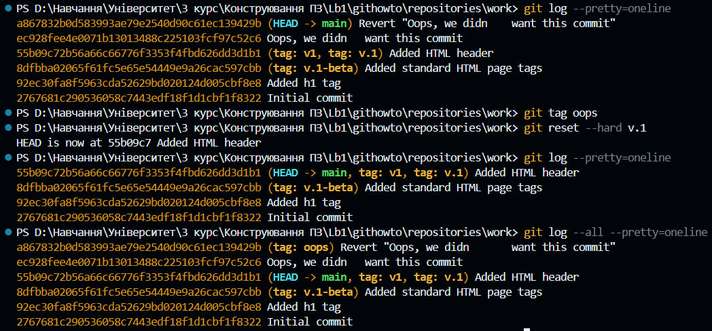

